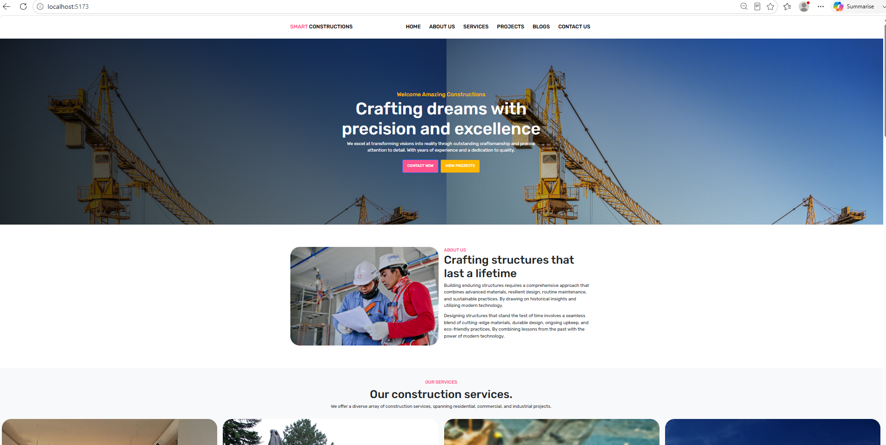

# 🏗️ Smart Construction Platform

A modern, full-stack web application designed for a construction management and corporate showcase platform. This project features a high-performance frontend coupled with a robust backend architecture to deliver a seamless user experience for clients exploring residential, commercial, and industrial engineering services.

---

## 🚀 Project Status: Phase 1 (Landing Page Complete)
The core informational architecture and responsive layout are fully implemented. The platform features:
* **Home:** High-impact hero section introducing the company's core vision.
* **About Us:** Professional corporate copy emphasizing durability and modern engineering.
* **Services:** Grid display showcasing architectural, design, and construction capabilities.
* **Projects:** A responsive showroom layout for displaying past and present structural builds.
* **Blogs:** An integrated content hub layout optimized for industry insights, guides, and corporate news.
* **Contact Us:** Interactive user inquiry and lead-generation form interface.

---

## 🛠️ Tech Stack & Architecture

### Frontend
* **React.js** (Component-driven UI construction)
* **Vite** (Next-generation lightning-fast frontend tooling)
* **SCSS / CSS3** (Modular, nested styling for scalable layout design)
* **Swiper.js** (Touch-responsive components for fluid testimonials slider)

### Backend
* **Laravel** (Robust PHP framework powering the underlying business logic)

### Environment & Tools
* **XAMPP** (Local Apache & MySQL server environment)
* **Git & GitHub** (Version control and deployment tracking)

---

## 📸 Application Preview
### **Landing Page View**
.
.

Files for the Apex Job portal application

---

## 📦 Local Installation & Setup

To run this project locally on your machine, follow these steps:

### Prerequisites
* PHP >=  8.2.12 
* Composer
* Node.js & npm
* XAMPP (or any local server environment)

### 1. Clone the Repository
```bash
git clone [https://github.com/juby1996/Smart-Construction.git](https://github.com/juby1996/Smart-Construction.git)
cd Smart-Construction
